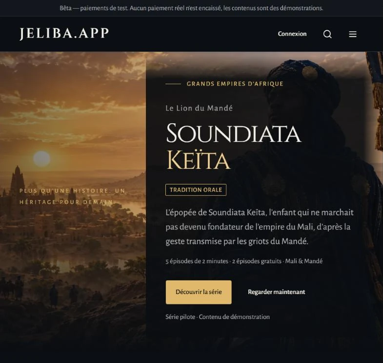
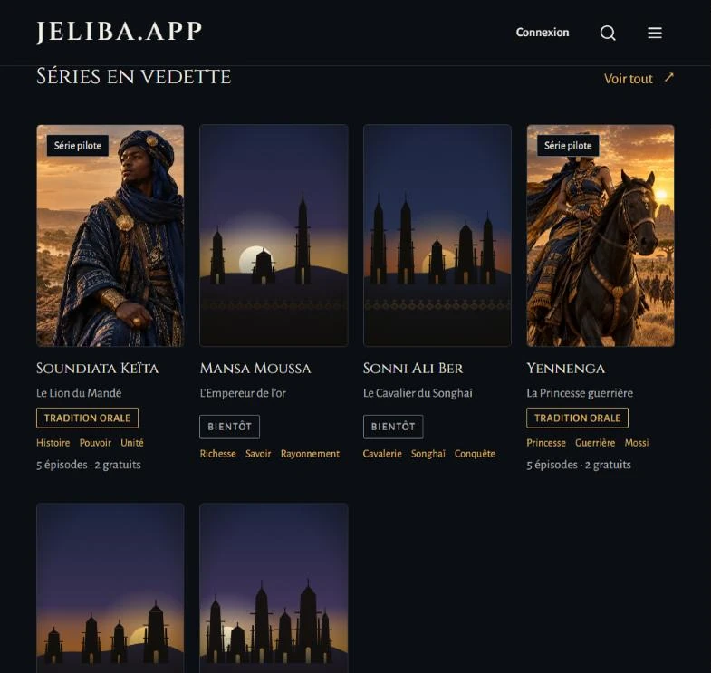
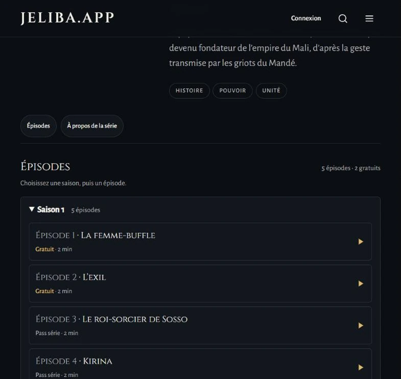
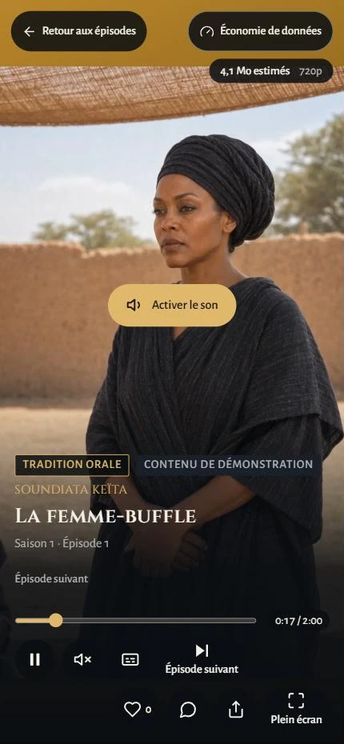
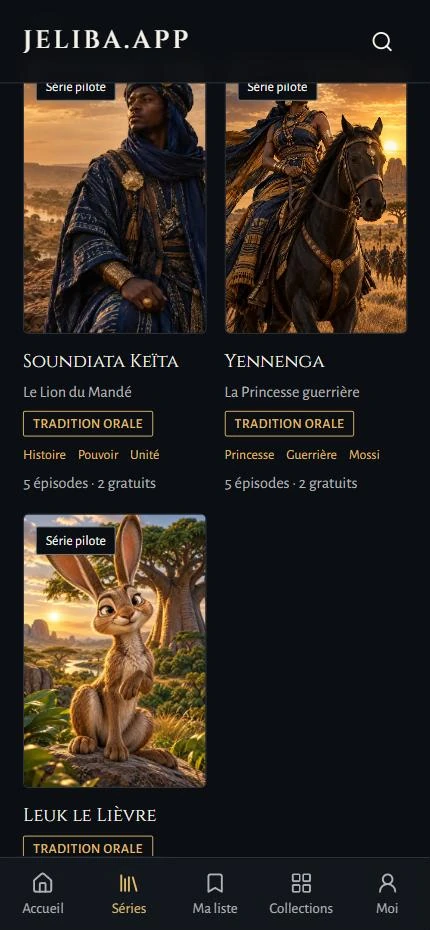
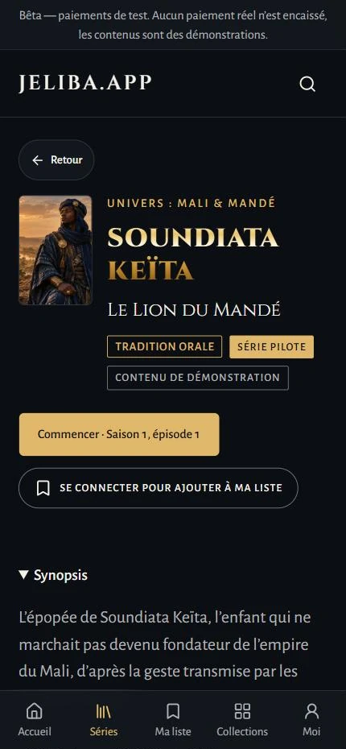

# Jeliba — Mobile-first video platform

> **Private source code.** The repository and internal documents are not public. This page describes the project and shows screenshots of the public beta.

**Project for Lawal Tech · Public beta · Test payments only**

[← Back to profile](../README.md)

## What it is for

Jeliba started as a platform for short vertical series about the history, epics and tales of West Africa, told in two-minute episodes. Its specification has since widened to a platform for several creators (series, films, animation and tales, from the company and from partners). The public beta currently shows three demonstration pilot series.

The web app comes first, and it is designed for phones and slow connections. Native Android and iOS apps are planned but not started. The project covers the platform; the videos are produced separately.

## My role

I am the developer of this project.

## What is live

The public beta has been online over HTTPS since September 2026. Visitors can:

- browse and search the catalogue, and open series pages with seasons and episodes;
- watch free episodes without an account, in a vertical player with subtitles, a data-saving mode and an estimate of the data an episode will use;
- sign in with a one-time code sent by email, then keep a list of series to watch, react to episodes and pick up where they left off.

The catalogue currently holds three pilot series, each with five episodes, two of them free. All of this content is labelled as demonstration content.

The team also has an admin back-office for series, episodes and orders.

## Technical choices

- **Server-side decisions.** Who may watch an episode, and at what price, is decided on the server in SQL and covered by pgTAP tests. The browser only displays the result.
- **Protected playback.** Every video, free ones included, needs a signed playback token valid for 20 minutes, issued after that access check. Knowing a video's ID is not enough to play it.
- **Careful money handling.** Amounts are stored as whole numbers in the smallest currency unit, never as floating point. Each order keeps a snapshot of what was bought. Access is granted only after a verified payment event: a check of the provider's secret hash, then a re-confirmation through the provider's API, with duplicate events ignored.
- **Low bandwidth first.** HLS playback with hls.js, a data-saving mode, and a 200 KiB (gzip) budget for initial JavaScript, measured on five key pages.
- **Ready for several languages.** Interface text goes through translation files, starting with French.

Stack: Next.js (App Router), React, TypeScript, Tailwind CSS, next-intl, hls.js · Supabase (PostgreSQL with row-level security) · pgTAP.

## Current status

- **Live:** the public beta described above.
- **Payments:** sandbox only; real payments are not enabled yet.
- **Not started:** native mobile apps.

## Screenshots

These screenshots were taken on 5 October 2026 on the public site, without signing in. Everything shown is demonstration content. The wide views were captured at about 800 px, the phone views at phone width.

*Home page of the public beta: a pilot series with its editorial label ("oral tradition") and a demo notice.*

*Featured series: two pilot series available, others announced as "coming soon".*

*Series page: two-minute episodes, the first two free.*

  
  
  

*On a phone: the vertical player on a free demo episode with its data-use estimate (4.1 MB at 720p), the catalogue of the three pilot series, and a series page with its editorial and demo labels.*
