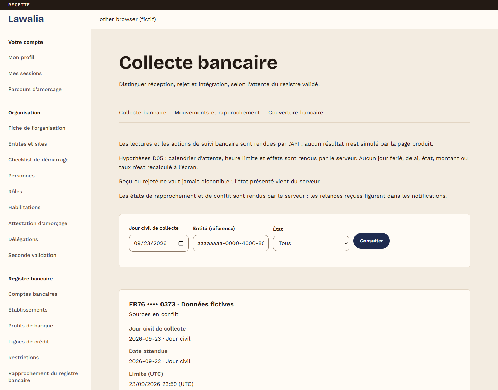
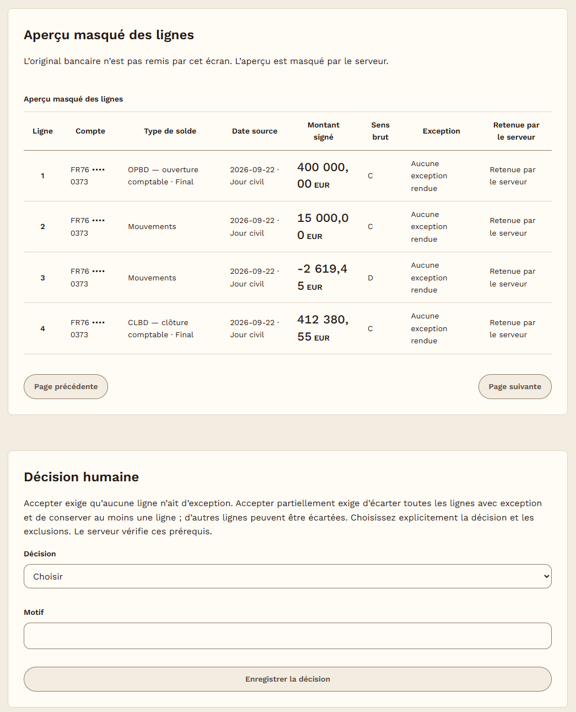
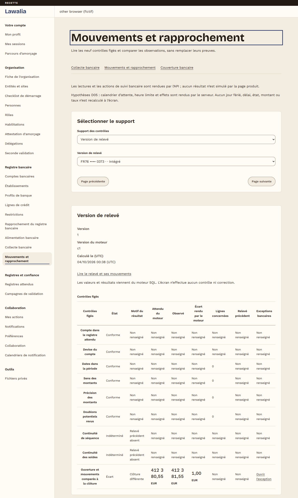
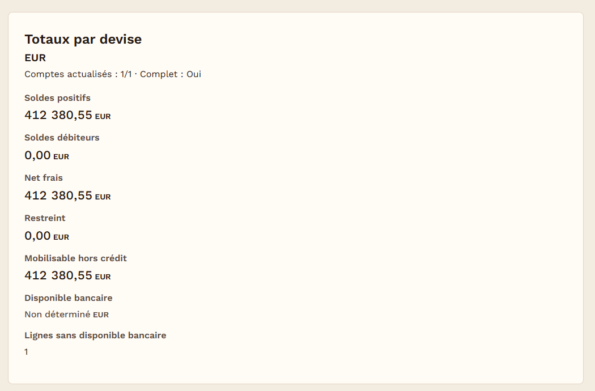
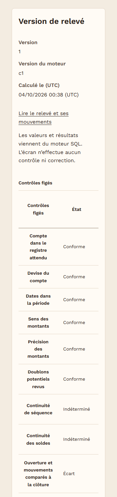

# Lawalia — Business software for francophone Africa

> **Private source code.** The repository and internal documents are not public. This page describes the project and shows screenshots made with fictitious data.

**Project for Lawal Tech · In development**

[← Back to profile](../README.md)

## What it is for

Lawalia is a management platform for business leaders in French-speaking Africa. The specification covers cash across several banks, contracts, governance, document records, internal control and supervised AI features.

The first business module is banking. For each bank account, the platform has to show which statement was expected, whether it arrived, whether it reconciles, and what the company's cash position is on a given date.

## My role

I am the developer of this project.

## What is built

Everything below is merged into the main branch.

**Foundation (stage 2 of 9, accepted on 1 October 2026 with reservations recorded)**

- Sign-in with two-factor authentication, sessions, invitations and account recovery.
- Organisations with separated data for each client. Roles, permissions, delegations, and a second person's approval for sensitive actions.
- Audit trail, background task queue, and private file storage with antivirus scanning and quotas.
- Collaboration and notifications, single sign-on (OIDC and SAML), data export, backup and restore.

**Banking (stage 3 of 9, in progress)**

- Bank register: accounts, banks, bank profiles, credit lines, restrictions, validation campaigns and duplicate detection.
- Statement import in CSV, XLSX, AFB120, MT940 and camt.052/053/054, tested on fictitious bank profiles only. The server shows a masked preview, and nothing is integrated until a person records a decision.
- A connector framework with a file adapter and a simulated API adapter; no real bank is connected yet.
- Tracking of expected statements, with reminders and escalation. Reconciliation controls, exceptions and coverage.
- A cash position by currency on a chosen date, with exchange rates and internal transfers.

## Technical choices

- **One authority.** The Laravel API is the only service that writes business data, and it decides permissions and sessions. The Next.js interface shows what the server returns. It does not recompute amounts or statuses.
- **Separation between clients.** PostgreSQL row-level security is a second barrier behind the API. The application connects with a database role that does not own the tables and cannot bypass these rules.
- **Contract first.** Every API route starts in an OpenAPI contract, and the interface uses types generated from it.
- **Isolated workers.** Python workers read bank statements and a Node service renders files such as exports. Neither can reach the database, file storage or sessions. They receive files through the API.
- **Honest numbers.** Amounts come from the server as exact decimals. When a value cannot be established, the screen says "not determined" instead of showing zero.
- **Checks that are themselves checked.** Code is checked with PHPStan, Pint, Vitest and Playwright, on desktop and phone layouts. Important checks also have a deliberately broken variant that must make them fail, which shows that the check is actually looking.

Stack: Next.js, React, TypeScript · Laravel (PHP) · PostgreSQL · Redis · S3-compatible storage · Python and Node workers · Docker Compose · GitHub Actions.

## Current status

- **Foundation:** accepted, with reservations recorded.
- **Banking:** in progress. Still open:
  - the certification backend (its screens exist, but they run on simulated responses only);
  - PDF reading and OCR (the OCR groundwork is merged; the rest is not finished);
  - acceptance of the banking stage, including validation by business users.
- **Design:** a visual redesign is merged, with a logo approved on 30 September 2026; a more compact header using it is merged and awaits final sign-off.
- **Data:** all data in the repository and in these screenshots is fictitious.

## Screenshots

These screenshots come from automated browser tests run on 3–4 October 2026 against the real API, on a local test stack with fictitious data. Account numbers are masked by the server. They show the earlier header, with the name "Lawalia" in plain text and a dark band marking a test environment; the header has changed since then.

*Bank collection workspace: each expected statement is tracked against a validated account register, with a cut-off time and conflict status. Fictitious data.*

*Statement import: the server returns a masked preview of the parsed lines; nothing is integrated until a person records an explicit decision. Fictitious data.*

*Reconciliation: nine frozen controls computed by the SQL engine; a 1.00 EUR gap between the expected and the received closing balance is flagged and linked to a bank exception. The test changes the statement's closing balance by 1.00 EUR on purpose. Fictitious data.*

*Dated cash position: per-currency totals come from the server as exact decimals; values that cannot be established are shown as "not determined", never as zero. Fictitious data.*

*The same reconciliation controls on a 360 px phone screen; wide columns scroll horizontally. Fictitious data.*
